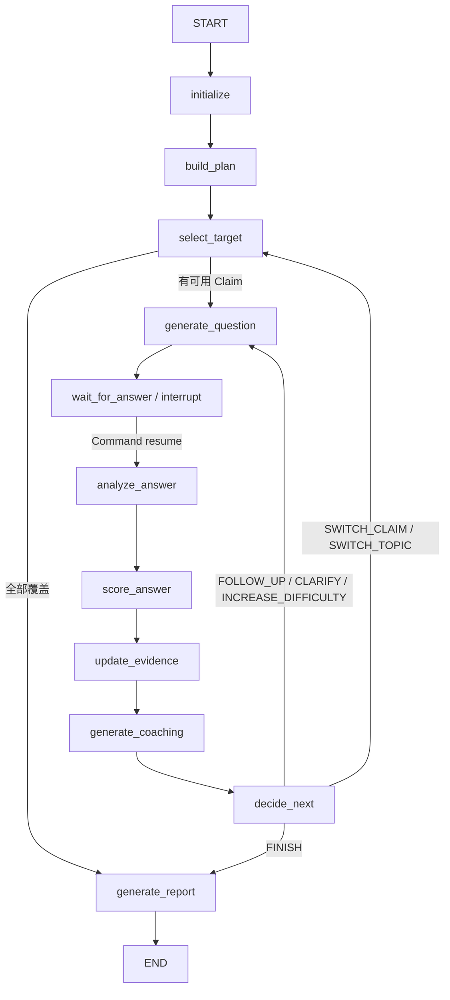

# Agent Loop 与决策机制

## 1. 总体图

当前 Graph 的真实节点顺序如下：



注意：当前实现中 Coaching 位于 `update_evidence` 之后、`decide_next` 之前。它并不是与评分完全并行的节点，因为 Coaching 会读取 Evaluation 和 Analysis。

## 2. InterviewState

Graph 的核心状态分为六组：

| 分类 | 关键字段 |
| --- | --- |
| 标识 | `interview_id`, `thread_id`, `resume_id`, `resume_revision_id` |
| 配置 | `target_role`, `job_description`, `interview_mode`, `max_turns` |
| 简历输入 | `resume_profile`, `resume_claims`, `interview_plan` |
| 当前目标 | `current_topic_id`, `current_claim_id`, `current_verification_point_id`, `current_depth`, `current_question` |
| 历史与证据 | `questions`, `answers`, `analyses`, `evaluations`, `claim_statuses`, `contradictions`, `evidence_items`, `coverage`, `ability_profile` |
| 流程与输出 | `turn_count`, `next_action`, `stop_reason`, `finished`, `latest_coaching`, `final_report` |

`thread_id` 同时用于业务会话和 LangGraph Checkpoint Config。

## 3. 节点职责

### initialize

- 初始化空历史、Claim Status、证据、Coverage 和流程字段。
- 将每个 Resume Claim 建立为可追踪状态。

### build_plan

- 从 `experiences / projects / research` 中选择有 Claim 的 Entry。
- 每个 Entry 对应一个 Topic。
- 将 Topic 按 Claim 优先级排序并分配权重。
- 根据最大轮次和项目数量计算每个 Topic 的最大问题数。
- Required Dimensions 包含项目概览、个人贡献、架构、生产和权衡。

### select_target

选择顺序：

1. 未解决矛盾。
2. 尚未完成的最高优先级 Claim。
3. Claim 中未验证的 Verification Point。
4. Verification Point 的 `target_depth` 作为初始深度。
5. 无 Claim 可选时返回 FINISH。

### generate_question

- 生成一个以完整项目为中心的问题。
- 第一题建立目标、架构、流程和个人职责。
- 后续题结合前序回答，追问设计决定、失败场景、边界和权衡。
- Claim 和 Expected Points 是内部证据线索，不直接泄露给作答中的用户。
- 输出 `InterviewQuestion`，包括题目、Topic/Claim、深度、Expected Points、强弱信号、红旗和候选追问。

### wait_for_answer

- 调用 LangGraph `interrupt()`。
- API 创建面试时，Graph 在第一题后暂停。
- 提交回答时通过：

```python
Command(resume={"answer_text": "用户回答"})
```

恢复 Graph。

### analyze_answer

输出 `AnswerAnalysis`：

- 回答摘要。
- 技术点和个人贡献证据。
- 已覆盖、部分覆盖和缺失的 Expected Points。
- 模糊陈述、可能错误、矛盾和无支持指标。
- 回答相关度、信息密度、继续追问价值。
- 推荐追问目标。

### score_answer

输出 `AnswerEvaluation`：

- 六维评分及每维原因、回答证据、缺失点和置信度。
- Strengths、Factual Errors、Unsupported Claims、Key Missing Points。
- Demonstrated Level。
- 模型推荐动作和深度；这些只是建议，最终路由仍由代码决定。

### update_evidence

- 将本题回答形成 `EvidenceItem`，保留最多 500 字的证据文本。
- 根据 Analysis 更新 Verification Point：
  - 无缺失且有覆盖：Verified Point。
  - 有覆盖也有缺失：Partial Point。
  - 没有覆盖：Missing Point。
- 更新 Claim Status：
  - 有矛盾：`CONTRADICTORY`。
  - 所有 Verification Points 完成：`VERIFIED`。
  - 部分完成：`PARTIALLY_VERIFIED`。
  - 否则：`IN_PROGRESS`。
- 更新 Topic Coverage。

### generate_coaching

输出 `AnswerCoaching`：

- `question_analysis`：问题试图考察什么。
- `what_was_good` / `what_to_improve`。
- `concise_answer`, `complete_answer`, `expert_answer`。
- `answer_framework`, `likely_follow_up_questions`, `knowledge_gaps`。
- 区分候选人已确认事实、需要候选人确认的内容和通用技术内容。
- LLM 失败时基于 Evaluation/Analysis 生成确定性兜底 Coaching。

### decide_next

这是代码控制的规则引擎，优先级如下：

| 优先级 | 条件 | 动作 | Reason |
| ---: | --- | --- | --- |
| 0 | 外部请求结束 | FINISH | 外部传入 |
| 1 | `turn_count >= max_turns` | FINISH | `MAX_TURNS` |
| 2 | 存在未解决矛盾 | FOLLOW_UP | `CONTRADICTION` |
| 3 | 回答相关度 `< 0.35` | CLARIFY | `LOW_RELEVANCE` |
| 4 | Implementation Depth `< 60` 且深度 `<= 3` | FOLLOW_UP | `LOW_IMPLEMENTATION` |
| 5 | 加权分 `>= 80` 且深度 `< 7` | INCREASE_DIFFICULTY | `HIGH_SCORE` |
| 6 | Claim 已完成/不支持/矛盾 | SWITCH_CLAIM | `CLAIM_DONE` |
| 7 | 达到 Topic 最大问题数 | SWITCH_CLAIM | `QUESTION_LIMIT` |
| 8 | 其他情况 | FOLLOW_UP，深度 +1 | `CONTINUE_DEEPENING` |

### generate_report

- 将确定性 Summary 作为权威指标传给 LLM。
- 明确区分 Questions Asked 和 Questions Answered。
- 用户主动结束产生的 `[END OF INTERVIEW]` 不计作零分回答。
- 生成：
  - Overall Score。
  - Ability Scores。
  - Claim Statuses。
  - Question Details。
  - Contradictions。
  - Coverage。
  - 自然语言报告正文。
- LLM 报告失败时仍返回基础 Summary。

## 4. 七级深度模型

| 深度 | 关注点 |
| ---: | --- |
| 1 | 背景、目标、职责 |
| 2 | 执行流程、端到端链路 |
| 3 | 代码、接口、数据结构 |
| 4 | 原理和设计理由 |
| 5 | 边界、故障、重试、并发 |
| 6 | 备选方案和权衡 |
| 7 | 反事实、演进和重新设计 |

## 5. 为什么不能把所有 LLM 调用并行

当前依赖关系为：

```text
Answer
  -> Analysis
  -> Evaluation(读取 Analysis)
  -> Evidence(读取 Analysis + Evaluation)
  -> Coaching(读取 Analysis + Evaluation)
  -> Decision(读取 Analysis + Evaluation + Evidence)
```

因此不能直接把 Analysis、Evaluation 和 Coaching 同时启动。可行的性能优化方向：

1. 在每个 Node 开始和结束时发布 SSE Phase Event，先改善真实进度感知。
2. 将 Evidence Update 与 Coaching 设计为评分后的并行分支，再在 Decision 前汇合。
3. 将 Coaching 延迟到下一题已返回之后异步补充，但需要处理 UI 和一致性。
4. Token Streaming 只适合自然语言正文；结构化 Pydantic 输出仍需在完整 JSON 生成后校验。

这些优化目前尚未在 Graph 中实现，前端现阶段提供的是阶段式等待反馈与业务事件流。

## 6. Checkpoint 与恢复

- Graph 编译时使用 `create_checkpointer()`。
- 创建面试后停在 `wait_for_answer` 前的 Interrupt。
- API 回答提交前检查当前 Question ID。
- 如果内存状态不存在，`_ensure_graph_checkpoint()` 使用数据库中的 Questions、Answers、Profile 和 Claims 重建状态。
- 重建时选择“最近一个尚未回答的问题”作为 Current Question。
- 已完成面试以数据库 `status=finished` 为终态来源。

