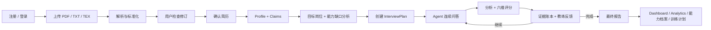

# 当前实现与产品效果

## 1. 产品目标

系统不是通用聊天机器人，而是围绕候选人真实简历开展连续深挖：

1. 将 PDF、TXT 或 TEX 简历转换为标准化文档。
2. 让用户检查并确认解析结果。
3. 构建结构化 Profile，提取可验证 Resume Claim。
4. 定义目标岗位与能力需求，对照简历声明做能力缺口分析。
5. 按项目/工作经历生成面试主题，而不是按孤立技术关键词机械出题。
6. 根据用户上一轮回答，继续深挖、澄清、提高难度或切换项目。
7. 对每题进行六维评分、证据一致性分析和回答辅导。
8. 汇总为面试报告、主张验证状态、跨场次能力档案和可执行的训练计划。

## 2. 已完成的端到端链路

### 2.1 简历处理

- 支持文件上传和纯文本上传。
- 自动识别来源类型并生成 `ResumeDocument`。
- 保存原始文本、标准化文本、块结构、解析器信息、质量分和警告。
- 用户可编辑未确认 Revision 的标准化文本，保存后重建 Blocks。
- 确认 Revision 时调用 Profile Builder 和 Claim Extractor。
- Profile 包含教育、工作、项目、研究、竞赛、技能等结构。
- Claim 包含来源 Entry、技术、期望能力层级、验证点、风险标记、优先级和置信度。
- Claim 可启用/停用，也可手动调整优先级。

### 2.2 面试计划

- 一个 Topic 对应一段项目、工作或研究经历。
- 同一项目中的多个技术 Claim 被合并理解，不会简单变成“一项技术一道题”。
- 项目按 Claim 最高优先级排序。
- 每个项目包含目标深度、最小/最大问题数、相关 Claims 和考察维度。
- 默认最大轮次为 15；前端允许配置 3–30 轮。
- 最大轮次是安全上限，不代表必须问满，也不是固定题库脚本。
- 可关联目标岗位（`job_target_id`）与模型档位（`model_tier`），用于对齐岗位能力需求并控制问题生成成本。

### 2.3 动态面试

- 第一题用于建立项目目标、架构、端到端流程和个人职责。
- 后续题根据真实回答选择实现细节、失败场景、权衡、边界或矛盾继续追问。
- LangGraph 在 `wait_for_answer` 节点暂停，收到回答后通过 `Command(resume=...)` 恢复。
- 路由由代码规则控制；LLM 负责生成和理解，不直接决定系统流程。

### 2.4 每题输出

每次回答处理后可以得到：

- `analysis`：回答摘要、技术点、个人贡献证据、已覆盖/部分覆盖/缺失的预期点、模糊表述、可能错误、矛盾和相关度。
- `evaluation`：六维评分、优势、事实错误、无证据主张、关键缺失点、置信度和模型建议。
- `coaching`：问题考察意图、做得好的地方、改进项、回答框架、知识缺口、可能追问和强回答示例。
- 下一题或面试结束状态。

“预期回答”在前端以“强回答示例”呈现。它用于说明一份完整回答应包含什么，不应被理解为候选人已经做过示例中的所有事情。

## 3. 深挖、切换项目和结束

系统按照以下优先级决定下一步：

1. 用户主动结束：生成报告并结束。
2. 达到 `max_turns`：结束。
3. 存在未解决矛盾：继续追问。
4. 回答相关度低于 0.35：澄清问题，并适当降低深度。
5. 实现深度分低于 60 且当前深度不超过 3：在当前项目继续追问。
6. 总分达到 80 且未达到深度 7：提高难度继续追问。
7. 当前 Claim 已 VERIFIED / UNSUPPORTED / CONTRADICTORY：切换 Claim/项目。
8. 当前项目已达到计划问题上限：切换 Claim/项目。
9. 默认行为：深度加一，继续追问。
10. 所有可选 Claim 均覆盖：结束并生成报告。

详细规则见 [Agent Loop 与决策机制](./agent-loop.md)。

## 4. 评分模型

| 维度 | 权重 |
| --- | ---: |
| 技术正确性 `technical_correctness` | 25% |
| 实现深度 `implementation_depth` | 20% |
| 架构与权衡 `architecture_tradeoffs` | 15% |
| 个人贡献 `personal_contribution` | 15% |
| 生产意识 `production_awareness` | 15% |
| 表达清晰度 `clarity` | 10% |

总分使用加权计算，不是六个维度的简单平均。

## 5. 数据持久化与恢复

### 已实现

- Resume Source、Revision、Blocks、Profile、Claims 均持久化。
- Interview、Questions、Answers、Analysis、Evaluation 和 Report 持久化。
- 面试详情优先读取 Graph State，同时用数据库问题和回答作为耐久兜底。
- 开发环境内存 Checkpoint 丢失后，可根据未回答的持久化 Question 重建 Graph Checkpoint。
- SSE 连接时主动发送当前状态快照，晚加入客户端可恢复当前问题或结束状态。
- 前端 SSE 断线后指数退避重连，最多 10 次。
- 前端每 5 秒轮询未完成的面试详情，作为 SSE 丢事件、刷新或浏览器挂起后的恢复路径。
- 回答草稿保存在 LocalStorage，以 `interviewId + questionId` 为键。
- 正在提交的题目和幂等键也保存在 LocalStorage；刷新重进后先显示恢复/分析状态，服务端历史确认回答已保存后再清除。

### 刷新或退出再进入的预期效果

- 未提交的草稿会恢复。
- 已提交且仍在处理的题目不会直接回到可重复提交状态。
- 当前问题、历史回答、评分和教练建议从服务端重新获取。
- SSE 重连后会接收状态快照；轮询负责兜底。
- 服务进程重启后，已落库的问题与回答可以用于恢复；尚未完成且尚未落库的 LLM 中间计算不保证保留。

## 6. 实时与加载体验

### 已实现

- SSE 事件级实时状态：初始化、问题就绪、回答接收、分析、评分、教练、结束、报告。
- 前端加载界面展示阶段、已等待秒数和恢复提示。
- 回答处理界面展示“理解回答、证据核验、多维评分、预期回答”四阶段。
- 长等待时页面仍提供上下文，不只显示一个小型 Spinner。
- 支持 `prefers-reduced-motion`，用户关闭动画时会自动减弱。

### 当前边界

- 当前不是 Token 级流式生成；SSE 传递的是业务事件和完整结构化结果。
- `analysis -> score -> evidence -> coaching -> decision` 当前存在数据依赖，不能全部并行。
- 评分可以先展示，预期回答在 Coaching 完成后补充。
- 若要进一步降低真实等待时间，需要在 Graph Node 内发布开始/完成事件，或将无依赖节点重构为 LangGraph 并行分支。

## 7. 前端整体效果

- 主应用采用固定深色品牌侧边栏和独立滚动内容区。
- 所有页面统一使用共享 `PageHeader` 与 `BackButton`（管理页无 Logo、无返回；创建/详情页带品牌 Logo 与左上角返回）。
- 面试房间使用三栏结构：历史与进度、当前问答/反馈、运行上下文。
- 创建面试页支持简历、岗位、模式、最大轮次、JD 和模型档位配置。
- 报告页提供结构化总结、能力分、逐题详情、主张护照、矛盾与覆盖视图。
- 目标岗位页支持模板 / JD 解析 / 空白三种创建方式，及岗位详情编辑。
- 能力档案页展示跨场次能力聚合、稳定性与迁移状态；训练计划页展示证据补强任务。
- 能力缺口页对比简历声明与岗位需求，展示覆盖统计与高优先缺口。
- 登录 / 注册页面与真实 JWT 鉴权打通。
- Dashboard 展示简历数、待确认数、面试数、进行中面试和平均分。
- Analytics 展示分数区间、强弱能力、Claim 验证率和时间趋势。
- 品牌视觉使用 `#0D1B2A` Navy、`#0EA5A0` Teal、`#22C1C3` Cyan，并使用 W + 对话/洞察组合 Logo。

完整页面说明见 [React 前端页面与交互](./frontend-pages.md)。

## 8. 鉴权与多用户

- 真实账号体系：注册、登录、当前用户查询，返回 JWT Bearer Token。
- 所有业务数据按 `user_id` 作用域隔离；简历、面试、岗位目标、报告、证据、能力档案等接口均校验属主，跨用户访问返回 404。
- 支持注销账号：删除用户及关联数据，返回删除统计（训练任务、能力档案、面试、简历、岗位、LLM 调用匿名化记录等）。

## 9. 目标岗位与能力需求

- 目标岗位目录（Job Target）：等级 `intern / junior / mid / senior / staff`，面试轮次 `resume / project / technical / system_design`。
- 三种创建方式：预设模板、JD 解析（AI 提取需求并推断等级/轮次）、手动创建。
- 每个岗位包含一组能力需求：能力编码（25 项后端/Agent 工程能力目录）、重要度（0–1）、期望水平（1–5）、证据期望清单。
- 模板创建的岗位名称不可修改，其余字段可编辑。
- 面试创建时可关联目标岗位，供面试计划生成与能力覆盖分析使用。

## 10. 证据状态机与矛盾检测

- 面试回答会按验证点更新证据状态：`UNSEEN → ADDRESSED → PARTIALLY_SUPPORTED → VERIFIED`，并保留每次迁移的历史（原因码、回答、证据片段、策略版本）。
- 检测回答与简历声明或前后回答之间的矛盾，生成矛盾记录、严重度和澄清问题。
- 报告页将证据状态以主张护照、覆盖、未解决矛盾、多形式验证等视图呈现。

## 11. 能力缺口分析

- 将简历主张映射到目标岗位能力需求，识别三类缺口：
  - `UNCOVERED_REQUIREMENT`：岗位需要但简历未覆盖。
  - `WEAK_EVIDENCE`：有主张但证据不足。
  - `CONTRADICTED_CLAIM`：简历声明与面试回答冲突。
- 输出覆盖统计（覆盖率、弱证据数、高优先缺口数）与高优先面试目标，用于指导下一轮面试计划。

## 12. 跨场次能力档案

- 从已完成的面试报告按能力维度聚合观察，形成每项能力的平均表现、稳定性（LOW / MEDIUM / HIGH）与逐场分数历史。
- 支持迁移验证状态，反映能力是否能在不同项目/情境中复用。

## 13. 训练计划

- 根据证据缺口与能力短板生成可执行训练任务，类型包括：证据补充、概念复习、深度提升、矛盾澄清、形式多样化、迁移练习。
- 每个任务带完成标准与优先级；状态 `PENDING / IN_PROGRESS / COMPLETED / DISMISSED`。
- 完成任务后可启动复验面试，针对性验证是否真正补强。

## 14. 模型档位与 LLM 路由

- 平台统一配置 LLM 模型，用户按任务选择合适的档位：`auto`（按任务自动路由）/ `fast` / `balanced` / `judge`。
- 后端按任务名映射到对应档位（`resolve_tier`），并在分析、评分、提问、教练、报告生成等节点传递该档位。
- 温度与最大 Token 由平台环境配置统一管理，用户不直接配置。

## 15. 当前限制与待办

- 生产部署需要使用耐久 LangGraph Checkpointer；开发默认内存 Checkpoint 本身不耐进程重启。
- SSE Sequence Counter 位于进程内，重启后会重新计数；前端详情轮询承担最终恢复兜底。
- SSE 当前不是 Token 级流式生成，传递的是业务事件和完整结构化结果。
- 报告导出目前支持 JSON 和基础 Markdown，不含 PDF/DOCX。
- Dashboard/Analytics 基于已有报告聚合，数据量大时需要专门的汇总表或缓存。
- 自动化端到端浏览器测试和可访问性审计仍应补充。
- 生产化事项（用量计费、限流、Key 轮换与密钥管理、模型档位落库等）见 [backlog](./backlog.md)。

